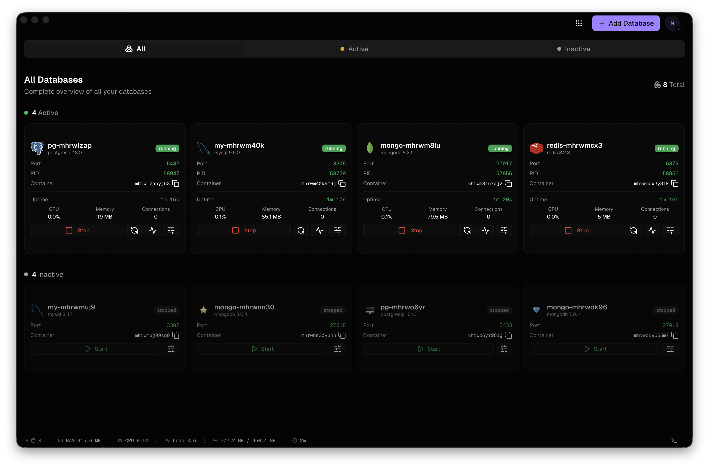

  
  
  # LiquiDB
  
  A modern, lightweight database management tool. Create, manage, and run multiple database instances locally with an intuitive interface.
  
  
  
  
  
  
  **[💬 Join our Discord community](https://discord.gg/2BuqtXDfVS)**

  

## Key Capabilities

LiquiDB provides a comprehensive solution for managing local database instances:

- **Multi-Database Support**: Manage PostgreSQL, MySQL, MongoDB, and Redis databases all in one place
- **Easy Installation**: Automatic database installation with version selection via platform package managers
- **Database Lifecycle Management**: Create, start, stop, and delete database instances with ease
- **Auto-Start**: Configure databases to automatically start when the application launches
- **Port Management**: Automatic port conflict detection and resolution
- **Real-Time Monitoring**: Monitor database status, system metrics, and resource usage
- **Version Management**: Install and manage multiple versions of each database type
- **Process Management**: Automatic cleanup of orphaned processes and proper shutdown handling
- **File Watching**: Monitor database configuration files for changes
- **System Integration**: Native platform integration with proper permissions handling
- **Modern UI**: Beautiful, responsive interface built with React and Tailwind CSS

## Quick Start

### Download

Visit [liquidb.app](https://liquidb.app) or [GitHub Releases](https://github.com/liquidb-app/LiquiDB/releases) to download LiquiDB for your platform:

- **macOS**: `LiquiDB-<version>-universal.dmg` (Universal - Intel & Apple Silicon)
- **Windows**: `LiquiDB Setup <version>.exe` (Installer) or `LiquiDB-<version>-win.zip` (Portable)
- **Linux**: `LiquiDB-<version>.AppImage` (AppImage) or `LiquiDB-<version>.deb` (DEB package)

### macOS Installation & Updates

#### First Launch

Since LiquiDB uses ad-hoc signing (as an open-source project), macOS Gatekeeper may show a security warning when you first open the app. To bypass this:

1. **Right-click** (or **Control-click**) on `LiquiDB.app` in Finder
2. Select **"Open"** from the context menu
3. Click **"Open"** in the security dialog that appears

Alternatively:
1. Go to **System Settings** > **Privacy & Security**
2. Scroll down to find the warning about LiquiDB
3. Click **"Open Anyway"**

This will add an exception for LiquiDB and allow it to run. You only need to do this once. After that, you can open LiquiDB normally by double-clicking.

**Note**: This is a standard macOS security feature. LiquiDB is safe to use - it's open source and all releases are verified via SHA256 hashes on GitHub.

#### Auto-Updates

LiquiDB automatically checks for updates and will notify you when a new version is available. When an update is ready:

1. Click **"Install Now"** in the update notification
2. The app will download and install the update automatically
3. After installation, you may need to allow the app again (same process as first launch):
   - Right-click the app and select **"Open"**, or
   - Go to **System Settings** > **Privacy & Security** and click **"Open Anyway"**

**Why the warnings?** As an open-source project, we're currently using free ad-hoc signing. We're working on getting a Developer ID certificate ($99/year) to improve the user experience and eliminate these warnings. [Consider sponsoring the project](#supporting-liquidb) to help us get there!

#### Troubleshooting Updates

If updates don't install automatically:
- Check that you have write permissions to the Applications folder
- Ensure the app isn't running from a read-only location
- Try manually downloading the latest release from [GitHub Releases](https://github.com/liquidb-app/LiquiDB/releases)

## Support

- **Website**: [liquidb.app](https://liquidb.app)
- **Email**: [team@liquidb.app](mailto:team@liquidb.app)
- **GitHub Issues**: [Report a bug or request a feature](https://github.com/liquidb-app/LiquiDB/issues)
- **Discord**: [Join our community](https://discord.gg/2BuqtXDfVS)

For security vulnerabilities, please see our [Security Policy](SECURITY.md).

## Supporting LiquiDB

LiquiDB is an open-source project built with ❤️ for developers everywhere. Your support helps us:

- **Improve the user experience**: Get a Developer ID certificate ($99/year) to eliminate macOS security warnings and enable seamless auto-updates
- **Maintain infrastructure**: Cover hosting costs for updates and releases
- **Continue development**: Keep building new features and fixing bugs

### How to Support

- ⭐ **Star the repository** on GitHub
- 🐛 **Report bugs** and suggest features
- 💻 **Contribute code** - see our [Contributing Guide](CONTRIBUTING.md)
- 💰 **Sponsor the project** - Coming soon (GitHub Sponsors, Open Collective)

**Note**: We're currently using ad-hoc signing for macOS, which is free but shows security warnings. With your support, we can upgrade to a Developer ID certificate for a better user experience!

## Contributing

We welcome contributions from the community! Whether you're fixing bugs, adding features, or improving documentation, your help makes LiquiDB better for everyone.

Please read our [Contributing Guide](CONTRIBUTING.md) to get started. It includes:

- How to set up your development environment
- Our coding standards and commit message conventions
- How to submit pull requests
- Our code of conduct

### Quick Contribution Steps

1. Fork the repository
2. Create a feature branch (`git checkout -b feature/amazing-feature`)
3. Make your changes following our [commit message conventions](CONTRIBUTING.md#commit-messages)
4. Test your changes thoroughly
5. Submit a pull request

For more details, see our [Contributing Guide](CONTRIBUTING.md).

## License

This project is licensed under the MIT License - see the [LICENSE](LICENSE) file for details.

## Acknowledgments

- Built with [Electron](https://www.electronjs.org/), [React](https://react.dev/), and [Next.js](https://nextjs.org/)
- UI components powered by [Radix UI](https://www.radix-ui.com/) and [shadcn/ui](https://ui.shadcn.com/)
- Styled with [Tailwind CSS](https://tailwindcss.com/)

---

  Made with ❤️ for developers everywhere

