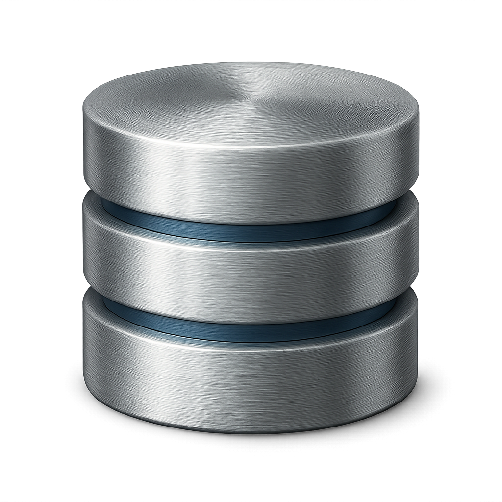

  
  
  # LiquiDB
  
  A modern, lightweight database management tool. Create, manage, and run multiple database instances locally with an intuitive interface.
  
  
  
  
  

## Key Capabilities

LiquiDB provides a comprehensive solution for managing local database instances:

- **Multi-Database Support**: Manage PostgreSQL, MySQL, MongoDB, and Redis databases all in one place
- **Easy Installation**: Automatic database installation with version selection via platform package managers
- **Database Lifecycle Management**: Create, start, stop, and delete database instances with ease
- **Auto-Start**: Configure databases to automatically start when the application launches
- **Port Management**: Automatic port conflict detection and resolution
- **Real-Time Monitoring**: Monitor database status, system metrics, and resource usage
- **Version Management**: Install and manage multiple versions of each database type
- **Process Management**: Automatic cleanup of orphaned processes and proper shutdown handling
- **File Watching**: Monitor database configuration files for changes
- **System Integration**: Native platform integration with proper permissions handling
- **Modern UI**: Beautiful, responsive interface built with React and Tailwind CSS

## Quick Start

### Download

Visit [liquidb.app](https://liquidb.app) or [GitHub Releases](https://github.com/liquidb-app/LiquiDB/releases) to download LiquiDB for your platform:

- **macOS**: `LiquiDB-<version>-universal.dmg` (Universal - Intel & Apple Silicon)
- **Windows**: `LiquiDB Setup <version>.exe` (Installer) or `LiquiDB-<version>-win.zip` (Portable)
- **Linux**: `LiquiDB-<version>.AppImage` (AppImage) or `LiquiDB-<version>.deb` (DEB package)

## Support

- **Website**: [liquidb.app](https://liquidb.app)
- **Email**: [team@liquidb.app](mailto:team@liquidb.app)
- **GitHub Issues**: [Report a bug or request a feature](https://github.com/liquidb-app/LiquiDB/issues)

For security vulnerabilities, please see our [Security Policy](SECURITY.md).

## Contributing

We welcome contributions from the community! Whether you're fixing bugs, adding features, or improving documentation, your help makes LiquiDB better for everyone.

Please read our [Contributing Guide](CONTRIBUTING.md) to get started. It includes:

- How to set up your development environment
- Our coding standards and commit message conventions
- How to submit pull requests
- Our code of conduct

### Quick Contribution Steps

1. Fork the repository
2. Create a feature branch (`git checkout -b feature/amazing-feature`)
3. Make your changes following our [commit message conventions](CONTRIBUTING.md#commit-messages)
4. Test your changes thoroughly
5. Submit a pull request

For more details, see our [Contributing Guide](CONTRIBUTING.md).

## License

This project is licensed under the MIT License - see the [LICENSE](LICENSE) file for details.

## Acknowledgments

- Built with [Electron](https://www.electronjs.org/), [React](https://react.dev/), and [Next.js](https://nextjs.org/)
- UI components powered by [Radix UI](https://www.radix-ui.com/) and [shadcn/ui](https://ui.shadcn.com/)
- Styled with [Tailwind CSS](https://tailwindcss.com/)

---

  Made with ❤️ for developers everywhere

